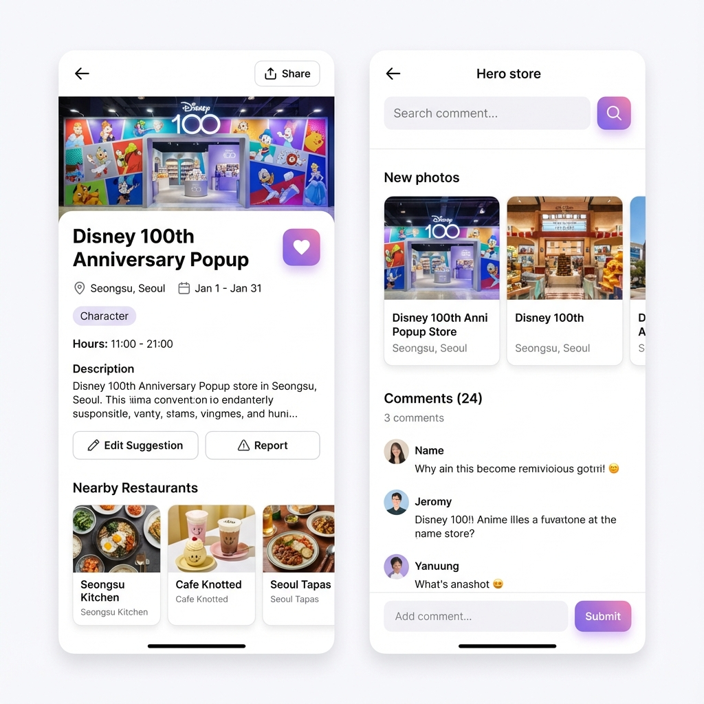
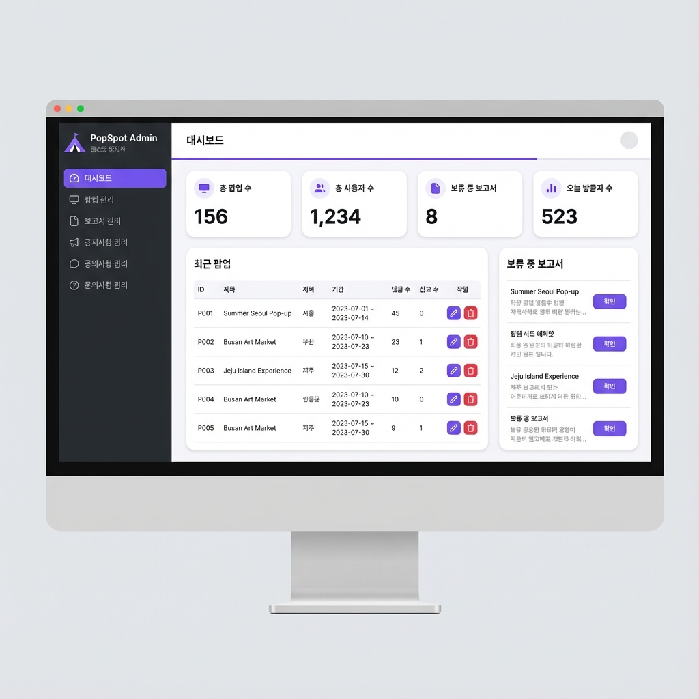
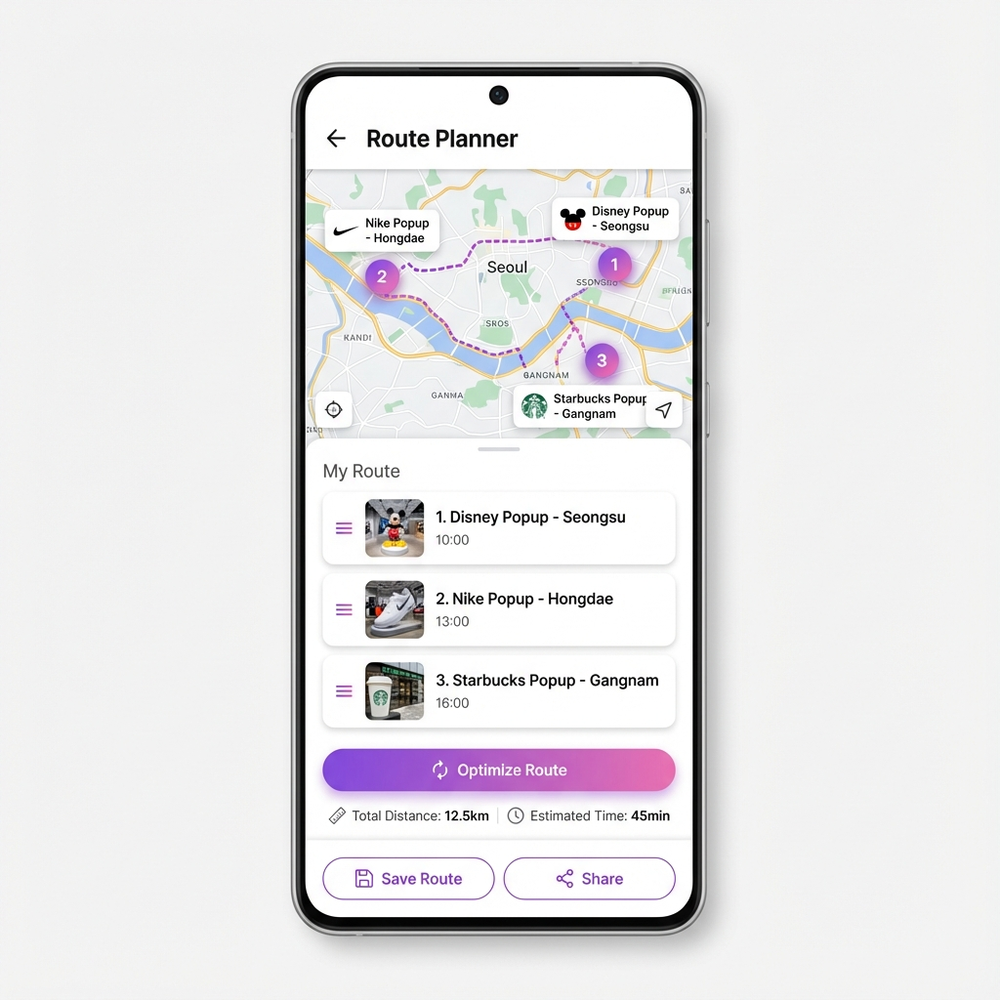

# 🎪 PopSpot (팝스팟) - 프로젝트 지시서

> **"대한민국 모든 팝업스토어를 한눈에!"**

**작성일**: 2026년 1월 5일  
**버전**: 1.0.0 (MVP)

---

## 📌 1. 프로젝트 개요

### 1.1 서비스 소개
PopSpot은 대한민국의 팝업스토어 정보를 한눈에 확인할 수 있는 플랫폼입니다. 사용자들은 현재 진행 중인 팝업스토어를 쉽게 찾고, 위치/날짜별로 필터링하며, 찜한 팝업들로 데이트 코스를 만들 수 있습니다.

### 1.2 핵심 가치
- **정보 접근성**: 흩어진 팝업스토어 정보를 한 곳에서 제공
- **사용자 참여**: 크라우드소싱 방식의 정보 등록 및 수정
- **부가 가치**: 경로 플래너, 주변 맛집 추천

### 1.3 타겟 사용자
- 팝업스토어를 좋아하는 MZ세대
- 데이트 코스를 고민하는 커플
- 새로운 경험을 찾는 사람들

---

## 👤 2. 사용자 역할 정의

| 역할 | 설명 | 주요 권한 |
|------|------|----------|
| **비회원** | 로그인하지 않은 사용자 | 팝업 조회, 검색, 필터링 |
| **일반회원** | 팝업을 이용하는 사용자 | + 찜하기, 댓글, 수정제안, 신고, 경로 플래너, 1:1 문의 |
| **사업자** | 팝업을 운영하는 사업자 | + 본인 팝업 등록/수정/삭제, 팝업 통계 확인 |
| **관리자** | 서비스 운영자 | + 모든 팝업 CRUD, 신고 관리, 공지 관리, 문의 답변 |

### 2.1 역할별 상세 권한

#### 일반회원 (User)
- 팝업스토어 조회/검색/필터링
- 팝업 찜하기 및 찜 목록 관리
- 팝업에 댓글/리뷰 작성
- 잘못된 정보 수정 제안
- 잘못된 팝업 신고
- 경로 플래너 이용
- 공지사항 확인
- 1:1 문의 작성

#### 사업자 (Business)
- 일반회원의 모든 권한
- 본인 사업 인증 (사업자등록번호)
- 팝업스토어 등록
- 본인이 등록한 팝업 수정/삭제
- 본인 팝업의 통계 확인 (조회수, 찜 수, 댓글 수)

#### 관리자 (Admin)
- 모든 사용자 권한
- 모든 팝업 등록/수정/삭제
- 신고 처리 (승인/반려)
- 공지사항 관리
- 1:1 문의 답변
- 사업자 인증 승인
- 전체 통계 대시보드

---

## 📋 3. 기능 명세

### 3.1 공통 기능

| ID | 기능 | 설명 | 우선순위 |
|:--:|------|------|:---:|
| C01 | 회원가입 | 이메일 + 비밀번호 + 닉네임 | P1 |
| C02 | 로그인 | JWT 기반 인증 | P1 |
| C03 | 로그아웃 | 세션 종료 | P1 |
| C04 | 반응형 디자인 | 모바일/태블릿/데스크탑 대응 | P1 |

### 3.2 사용자 기능 (User)

#### 3.2.1 팝업 조회

| ID | 기능 | 설명 | 우선순위 |
|:--:|------|------|:---:|
| U01 | 팝업 목록 | 전체 팝업 리스트 표시 | P1 |
| U02 | 뷰 전환 | 리스트뷰 ↔ 그리드뷰 | P1 |
| U03 | 팝업 상세 | 이미지, 위치, 기간, 운영시간, 설명 | P1 |
| U04 | 날짜 필터 | 특정 날짜에 진행 중인 팝업 필터링 | P1 |
| U05 | 지역 필터 | 지역별 팝업 필터링 | P1 |
| U06 | 카테고리 필터 | 카테고리별 필터링 | P2 |
| U07 | 키워드 검색 | 팝업명/브랜드명 검색 | P1 |
| U08 | 내 주변 팝업 | GPS 기반 반경 내 팝업 표시 | P2 |

#### 3.2.2 팝업 참여 (일반회원)

| ID | 기능 | 설명 | 우선순위 |
|:--:|------|------|:---:|
| U09 | 찜하기 | 팝업 즐겨찾기 (로그인 필요) | P1 |
| U10 | 찜 취소 | 찜 해제 | P1 |
| U11 | 댓글 작성 | 팝업별 후기 작성 | P1 |
| U12 | 댓글 삭제 | 본인 댓글 삭제 | P2 |
| U13 | 수정 제안 | 잘못된 정보 수정 요청 | P2 |
| U14 | 신고하기 | 잘못된 정보/스팸 신고 | P2 |

### 3.3 사업자 기능 (Business)

#### 3.3.1 팝업 관리

| ID | 기능 | 설명 | 우선순위 |
|:--:|------|------|:---:|
| B01 | 팝업 등록 | 새 팝업스토어 등록 | P1 |
| B02 | 팝업 수정 | 본인 등록 팝업 수정 | P1 |
| B03 | 팝업 삭제 | 본인 등록 팝업 삭제 | P1 |
| B04 | 내 팝업 목록 | 등록한 팝업 목록 확인 | P1 |
| B05 | 팝업 통계 | 조회수, 찜 수, 댓글 수 확인 | P2 |

#### 3.3.2 사업자 인증

| ID | 기능 | 설명 | 우선순위 |
|:--:|------|------|:---:|
| B06 | 사업자 인증 신청 | 사업자등록번호로 인증 요청 | P1 |
| B07 | 인증 상태 확인 | 인증 승인/대기/반려 확인 | P1 |

#### 3.2.3 부가 기능 (일반회원)

| ID | 기능 | 설명 | 우선순위 |
|:--:|------|------|:---:|
| U15 | 경로 플래너 | 찜한 팝업들 최적 경로 생성 | P2 |
| U16 | 주변 맛집 | 팝업 주변 맛집 리스트 | P3 |
| U17 | 알림 설정 | 찜한 팝업 알림 on/off | P3 |

#### 3.2.4 고객 지원

| ID | 기능 | 설명 | 우선순위 |
|:--:|------|------|:---:|
| U19 | 공지사항 목록 | 관리자 공지 목록 | P2 |
| U20 | 공지사항 상세 | 공지 내용 확인 | P2 |
| U21 | 1:1 문의 작성 | 관리자에게 문의 | P2 |
| U22 | 내 문의 목록 | 문의 내역 + 답변 확인 | P2 |

#### 3.2.5 마이페이지

| ID | 기능 | 설명 | 우선순위 |
|:--:|------|------|:---:|
| U23 | 내 정보 수정 | 닉네임, 비밀번호 변경 | P1 |
| U24 | 찜 목록 | 찜한 팝업 모아보기 | P1 |
| U25 | 내 댓글 | 작성한 댓글 목록 | P2 |
| U26 | 내 등록 팝업 | 내가 등록한 팝업 목록 | P2 |

### 3.4 관리자 기능 (Admin)

#### 3.4.1 대시보드

| ID | 기능 | 설명 | 우선순위 |
|:--:|------|------|:---:|
| A01 | 통계 카드 | 총 팝업수, 회원수, 신고수, 방문자수 | P1 |
| A02 | 최근 팝업 | 최근 등록된 팝업 목록 | P2 |
| A03 | 대기중 신고 | 처리 대기 중인 신고 목록 | P2 |

#### 3.4.2 팝업 관리

| ID | 기능 | 설명 | 우선순위 |
|:--:|------|------|:---:|
| A04 | 팝업 목록 | 전체 팝업 + 댓글수/신고수 표시 | P1 |
| A05 | 팝업 등록 | 관리자 직접 등록 | P1 |
| A06 | 팝업 수정 | 모든 팝업 수정 가능 | P1 |
| A07 | 팝업 삭제 | 팝업 삭제 | P1 |
| A08 | 팝업 검색 | 제목/지역 검색 | P2 |

#### 3.4.3 신고 관리

| ID | 기능 | 설명 | 우선순위 |
|:--:|------|------|:---:|
| A09 | 신고 목록 | 전체 신고 내역 | P1 |
| A10 | 신고 상세 | 신고 내용 확인 | P1 |
| A11 | 신고 승인 | 신고 내용 반영 (팝업 삭제 등) | P1 |
| A12 | 신고 반려 | 신고 무효 처리 | P1 |

#### 3.4.4 공지 관리

| ID | 기능 | 설명 | 우선순위 |
|:--:|------|------|:---:|
| A13 | 공지 목록 | 전체 공지사항 | P2 |
| A14 | 공지 등록 | 새 공지 작성 | P2 |
| A15 | 공지 수정 | 공지 내용 수정 | P2 |
| A16 | 공지 삭제 | 공지 삭제 | P2 |

#### 3.4.5 문의 관리

| ID | 기능 | 설명 | 우선순위 |
|:--:|------|------|:---:|
| A17 | 문의 목록 | 1:1 문의 전체 목록 | P2 |
| A18 | 문의 상세 | 문의 내용 확인 | P2 |
| A19 | 답변 작성 | 문의에 답변 작성 | P2 |

#### 3.4.6 사업자 관리

| ID | 기능 | 설명 | 우선순위 |
|:--:|------|------|:---:|
| A20 | 사업자 목록 | 사업자 인증 요청 목록 | P1 |
| A21 | 사업자 승인 | 사업자 인증 승인 | P1 |
| A22 | 사업자 반려 | 사업자 인증 반려 | P1 |

---

## 🗂️ 4. 데이터 모델

### 4.1 팝업스토어 (Popup)

```typescript
interface Popup {
  id: string;
  title: string;                    // 팝업명
  brand: string;                    // 브랜드명
  category: Category;               // 카테고리
  images: string[];                 // 이미지 URL 배열
  description: string;              // 설명
  location: {
    address: string;                // 주소
    lat: number;                    // 위도
    lng: number;                    // 경도
    region: Region;                 // 지역 (서울/성수, 서울/홍대 등)
  };
  period: {
    start: string;                  // 시작일 (YYYY-MM-DD)
    end: string;                    // 종료일 (YYYY-MM-DD)
  };
  hours: string;                    // 운영시간
  website?: string;                 // 공식 웹사이트
  instagram?: string;               // 인스타그램
  
  // 메타 정보
  likes: number;                    // 찜 수
  commentCount: number;             // 댓글 수
  reportCount: number;              // 신고 수
  status: 'active' | 'ended' | 'deleted';
  
  createdBy: string;                // 등록자 ID
  createdAt: string;
  updatedAt: string;
}

type Category = 
  | 'fashion'       // 패션
  | 'beauty'        // 뷰티
  | 'character'     // 캐릭터
  | 'food'          // F&B
  | 'lifestyle'     // 라이프스타일
  | 'art'           // 아트/전시
  | 'entertainment' // 엔터테인먼트
  | 'other';        // 기타

type Region =
  | '서울/성수'
  | '서울/홍대'
  | '서울/강남'
  | '서울/명동'
  | '서울/여의도'
  | '서울/기타'
  | '경기'
  | '부산'
  | '기타';
```

### 4.2 사용자 (User)

```typescript
interface User {
  id: string;
  email: string;
  password: string;                 // 해시된 비밀번호
  nickname: string;
  profileImage?: string;
  role: 'user' | 'business' | 'admin';  // 일반회원, 사업자, 관리자
  
  // 사업자 정보 (role이 'business'인 경우)
  businessInfo?: {
    businessNumber: string;         // 사업자등록번호
    companyName: string;            // 상호명
    representative: string;         // 대표자명
    verificationStatus: 'pending' | 'approved' | 'rejected';
    verifiedAt?: string;
  };
  
  favorites: string[];              // 찜한 팝업 ID 배열
  notifications: boolean;           // 알림 설정
  
  createdAt: string;
  updatedAt: string;
}

type UserRole = 'user' | 'business' | 'admin';
```

### 4.3 댓글 (Comment)

```typescript
interface Comment {
  id: string;
  popupId: string;
  userId: string;
  userNickname: string;
  userProfileImage?: string;
  content: string;
  
  createdAt: string;
  updatedAt: string;
}
```

### 4.4 신고 (Report)

```typescript
interface Report {
  id: string;
  popupId: string;
  popupTitle: string;
  userId: string;
  userNickname: string;
  
  type: ReportType;
  description: string;
  
  status: 'pending' | 'approved' | 'rejected';
  processedBy?: string;             // 처리한 관리자 ID
  processedAt?: string;
  
  createdAt: string;
}

type ReportType =
  | 'wrong_info'    // 잘못된 정보
  | 'ended'         // 이미 종료됨
  | 'duplicate'     // 중복 등록
  | 'spam'          // 스팸/광고
  | 'other';        // 기타
```

### 4.5 공지사항 (Notice)

```typescript
interface Notice {
  id: string;
  title: string;
  content: string;
  isImportant: boolean;             // 중요 공지 여부
  
  createdBy: string;
  createdAt: string;
  updatedAt: string;
}
```

### 4.6 1:1 문의 (Inquiry)

```typescript
interface Inquiry {
  id: string;
  userId: string;
  userEmail: string;
  userNickname: string;
  
  title: string;
  content: string;
  
  status: 'pending' | 'answered';
  answer?: string;
  answeredBy?: string;
  answeredAt?: string;
  
  createdAt: string;
}
```

### 4.7 수정 제안 (EditSuggestion)

```typescript
interface EditSuggestion {
  id: string;
  popupId: string;
  userId: string;
  userNickname: string;
  
  field: string;                    // 수정 요청 필드
  currentValue: string;             // 현재 값
  suggestedValue: string;           // 제안 값
  reason: string;                   // 수정 이유
  
  status: 'pending' | 'approved' | 'rejected';
  processedBy?: string;
  processedAt?: string;
  
  createdAt: string;
}
```

---

## 📱 5. 페이지 구조

### 5.1 사용자 페이지

| 경로 | 페이지명 | 설명 | 인증 |
|------|---------|------|:---:|
| `/` | 홈 | 팝업 목록 (메인) | X |
| `/popup/[id]` | 팝업 상세 | 팝업 상세 정보 | X |
| `/popup/new` | 팝업 등록 | 새 팝업 등록 폼 | O |
| `/popup/[id]/edit` | 수정 제안 | 수정 제안 폼 | O |
| `/planner` | 경로 플래너 | 찜한 팝업 경로 생성 | O |
| `/login` | 로그인 | 로그인/회원가입 | X |
| `/mypage` | 마이페이지 | 내 정보, 찜 목록 등 | O |
| `/mypage/comments` | 내 댓글 | 작성한 댓글 목록 | O |
| `/mypage/popups` | 내 등록 팝업 | 내가 등록한 팝업 | O |
| `/notice` | 공지사항 | 공지 목록 | X |
| `/notice/[id]` | 공지 상세 | 공지 내용 | X |
| `/inquiry` | 1:1 문의 | 문의 작성 | O |
| `/inquiry/list` | 문의 내역 | 내 문의 목록 | O |

### 5.2 관리자 페이지

| 경로 | 페이지명 | 설명 |
|------|---------|------|
| `/admin` | 대시보드 | 통계 개요 |
| `/admin/popups` | 팝업 관리 | 팝업 목록 + CRUD |
| `/admin/popups/new` | 팝업 등록 | 관리자 팝업 등록 |
| `/admin/popups/[id]/edit` | 팝업 수정 | 팝업 정보 수정 |
| `/admin/reports` | 신고 관리 | 신고 목록 + 처리 |
| `/admin/notices` | 공지 관리 | 공지 CRUD |
| `/admin/notices/new` | 공지 등록 | 새 공지 작성 |
| `/admin/notices/[id]/edit` | 공지 수정 | 공지 수정 |
| `/admin/inquiries` | 문의 관리 | 문의 목록 + 답변 |

---

## 🛠️ 6. 기술 스택

### 6.1 Frontend

| 기술 | 버전 | 용도 |
|------|------|------|
| **Next.js** | 14+ | React 프레임워크 (App Router) |
| **TypeScript** | 5+ | 타입 안정성 |
| **CSS Modules** | - | 컴포넌트 스타일링 |
| **React Icons** | 5+ | 아이콘 |
| **Zustand** | 4+ | 클라이언트 상태 관리 |

### 6.2 Backend (MVP)

| 기술 | 용도 |
|------|------|
| **Next.js API Routes** | 백엔드 API |
| **LocalStorage / JSON** | MVP용 데이터 저장 |

### 6.3 추후 확장 (프로덕션)

| 기술 | 용도 |
|------|------|
| **PostgreSQL** | 데이터베이스 |
| **Prisma** | ORM |
| **NextAuth.js** | 인증 |
| **AWS S3** | 이미지 저장소 |
| **Vercel** | 배포 |

### 6.4 외부 API

| API | 용도 | 필수 |
|-----|------|:---:|
| **Geolocation API** | 사용자 위치 확인 | O |
| **Kakao Maps API** | 지도 표시, 경로 | O |
| **Kakao Local API** | 주변 맛집 검색 | △ |

---

## 🎨 7. 디자인 가이드

### 7.1 컬러 팔레트

```css
:root {
  /* Primary - 그라데이션 */
  --primary-gradient: linear-gradient(135deg, #667eea 0%, #764ba2 100%);
  --primary-purple: #667eea;
  --primary-pink: #764ba2;
  
  /* Secondary */
  --secondary-orange: #f093fb;
  --secondary-coral: #f5576c;
  
  /* Neutral */
  --gray-900: #1a1a2e;
  --gray-800: #16213e;
  --gray-700: #2d3748;
  --gray-600: #4a5568;
  --gray-500: #718096;
  --gray-400: #a0aec0;
  --gray-300: #cbd5e0;
  --gray-200: #e2e8f0;
  --gray-100: #f7fafc;
  --white: #ffffff;
  
  /* Semantic */
  --success: #48bb78;
  --warning: #ecc94b;
  --error: #f56565;
  --info: #4299e1;
  
  /* Background */
  --bg-primary: #ffffff;
  --bg-secondary: #f7fafc;
  --bg-dark: #1a1a2e;
}
```

### 7.2 타이포그래피

```css
:root {
  /* Font Family */
  --font-primary: 'Pretendard', -apple-system, BlinkMacSystemFont, sans-serif;
  
  /* Font Size */
  --text-xs: 0.75rem;     /* 12px */
  --text-sm: 0.875rem;    /* 14px */
  --text-base: 1rem;      /* 16px */
  --text-lg: 1.125rem;    /* 18px */
  --text-xl: 1.25rem;     /* 20px */
  --text-2xl: 1.5rem;     /* 24px */
  --text-3xl: 1.875rem;   /* 30px */
  --text-4xl: 2.25rem;    /* 36px */
  
  /* Font Weight */
  --font-normal: 400;
  --font-medium: 500;
  --font-semibold: 600;
  --font-bold: 700;
}
```

### 7.3 간격 (Spacing)

```css
:root {
  --space-1: 0.25rem;   /* 4px */
  --space-2: 0.5rem;    /* 8px */
  --space-3: 0.75rem;   /* 12px */
  --space-4: 1rem;      /* 16px */
  --space-5: 1.25rem;   /* 20px */
  --space-6: 1.5rem;    /* 24px */
  --space-8: 2rem;      /* 32px */
  --space-10: 2.5rem;   /* 40px */
  --space-12: 3rem;     /* 48px */
  --space-16: 4rem;     /* 64px */
}
```

### 7.4 컴포넌트 스타일

```css
:root {
  /* Border Radius */
  --radius-sm: 0.25rem;   /* 4px */
  --radius-md: 0.5rem;    /* 8px */
  --radius-lg: 0.75rem;   /* 12px */
  --radius-xl: 1rem;      /* 16px */
  --radius-2xl: 1.5rem;   /* 24px */
  --radius-full: 9999px;
  
  /* Shadow */
  --shadow-sm: 0 1px 2px rgba(0, 0, 0, 0.05);
  --shadow-md: 0 4px 6px rgba(0, 0, 0, 0.1);
  --shadow-lg: 0 10px 15px rgba(0, 0, 0, 0.1);
  --shadow-xl: 0 20px 25px rgba(0, 0, 0, 0.15);
  
  /* Transition */
  --transition-fast: 150ms ease;
  --transition-normal: 300ms ease;
  --transition-slow: 500ms ease;
}
```

### 7.5 반응형 브레이크포인트

```css
/* Mobile First */
/* 기본: 0px ~ */
/* sm: 640px ~ */
/* md: 768px ~ */
/* lg: 1024px ~ */
/* xl: 1280px ~ */
```

---

## 📂 8. 프로젝트 구조

```
popspot/
├── app/
│   ├── layout.tsx                  # 루트 레이아웃
│   ├── page.tsx                    # 홈페이지
│   ├── globals.css                 # 전역 스타일
│   │
│   ├── (auth)/
│   │   ├── login/page.tsx          # 로그인
│   │   └── register/page.tsx       # 회원가입
│   │
│   ├── popup/
│   │   ├── [id]/page.tsx           # 팝업 상세
│   │   ├── [id]/edit/page.tsx      # 수정 제안
│   │   └── new/page.tsx            # 팝업 등록
│   │
│   ├── planner/page.tsx            # 경로 플래너
│   │
│   ├── mypage/
│   │   ├── page.tsx                # 마이페이지 메인
│   │   ├── comments/page.tsx       # 내 댓글
│   │   └── popups/page.tsx         # 내 등록 팝업
│   │
│   ├── notice/
│   │   ├── page.tsx                # 공지 목록
│   │   └── [id]/page.tsx           # 공지 상세
│   │
│   ├── inquiry/
│   │   ├── page.tsx                # 문의 작성
│   │   └── list/page.tsx           # 문의 내역
│   │
│   ├── admin/
│   │   ├── layout.tsx              # 관리자 레이아웃
│   │   ├── page.tsx                # 대시보드
│   │   ├── popups/
│   │   │   ├── page.tsx            # 팝업 관리
│   │   │   ├── new/page.tsx        # 팝업 등록
│   │   │   └── [id]/edit/page.tsx  # 팝업 수정
│   │   ├── reports/page.tsx        # 신고 관리
│   │   ├── notices/
│   │   │   ├── page.tsx            # 공지 관리
│   │   │   ├── new/page.tsx        # 공지 등록
│   │   │   └── [id]/edit/page.tsx  # 공지 수정
│   │   └── inquiries/page.tsx      # 문의 관리
│   │
│   └── api/                        # API Routes
│       ├── auth/
│       ├── popups/
│       ├── comments/
│       ├── reports/
│       ├── notices/
│       └── inquiries/
│
├── components/
│   ├── common/
│   │   ├── Header.tsx
│   │   ├── Footer.tsx
│   │   ├── Button.tsx
│   │   ├── Input.tsx
│   │   ├── Modal.tsx
│   │   ├── Card.tsx
│   │   └── Loading.tsx
│   │
│   ├── popup/
│   │   ├── PopupCard.tsx
│   │   ├── PopupList.tsx
│   │   ├── PopupGrid.tsx
│   │   ├── PopupFilter.tsx
│   │   ├── PopupDetail.tsx
│   │   ├── PopupForm.tsx
│   │   └── CommentSection.tsx
│   │
│   ├── user/
│   │   ├── LoginForm.tsx
│   │   ├── RegisterForm.tsx
│   │   ├── ProfileCard.tsx
│   │   └── FavoriteList.tsx
│   │
│   ├── planner/
│   │   ├── RouteMap.tsx
│   │   ├── RouteList.tsx
│   │   └── NearbyRestaurants.tsx
│   │
│   └── admin/
│       ├── Sidebar.tsx
│       ├── StatsCard.tsx
│       ├── DataTable.tsx
│       └── AdminPopupForm.tsx
│
├── lib/
│   ├── utils.ts                    # 유틸리티 함수
│   ├── api.ts                      # API 클라이언트
│   └── constants.ts                # 상수
│
├── store/
│   ├── useAuthStore.ts             # 인증 상태
│   ├── usePopupStore.ts            # 팝업 상태
│   └── useFavoriteStore.ts         # 찜 상태
│
├── types/
│   └── index.ts                    # 타입 정의
│
├── data/
│   ├── popups.json                 # 샘플 팝업 데이터
│   ├── users.json                  # 샘플 유저 데이터
│   └── notices.json                # 샘플 공지 데이터
│
├── public/
│   ├── images/
│   └── icons/
│
├── docs/
│   └── PROJECT_SPEC.md             # 이 문서
│
├── package.json
├── tsconfig.json
├── next.config.js
└── README.md
```

---

## 💰 9. 예상 개발 비용

### 9.1 직접 개발 (프리랜서/개인)

| 단계 | 작업 내용 | 예상 기간 | 예상 비용 |
|------|----------|----------|----------|
| 기획 | 상세 기획, 화면 설계 | 1주 | 100~200만원 |
| 디자인 | UI/UX 디자인 | 2주 | 200~400만원 |
| 프론트엔드 | Next.js 개발 | 4주 | 400~800만원 |
| 백엔드 | API 개발 | 3주 | 300~600만원 |
| 테스트/배포 | QA, 배포 설정 | 1주 | 100~200만원 |
| **합계** | | **11주** | **1,100~2,200만원** |

### 9.2 MVP (최소 기능)

| 항목 | 예상 비용 |
|------|----------|
| 프론트엔드만 (LocalStorage) | 300~500만원 |
| 디자인 (템플릿 활용) | 50~100만원 |
| **합계** | **350~600만원** |

### 9.3 외주 에이전시

| 규모 | 예상 비용 |
|------|----------|
| 소규모 에이전시 | 2,000~4,000만원 |
| 중규모 에이전시 | 5,000~8,000만원 |

### 9.4 월 운영 비용

| 항목 | 예상 비용/월 |
|------|-------------|
| Vercel (호스팅) | 무료~$20 |
| 데이터베이스 | $10~50 |
| 도메인 | 연 2~3만원 |
| Kakao API | 무료 (일정 호출량) |
| **합계** | **월 0~10만원** |

---

## 🌐 10. 도메인 추천

| 도메인 | 가용성 | 연간 비용 | 비고 |
|--------|:---:|----------|------|
| **popspot.kr** | ⭐ 추천 | ~22,000원 | 직관적 |
| **popupspot.co.kr** | 가능 | ~22,000원 | |
| **popupmap.kr** | 가능 | ~22,000원 | |
| **popfinder.kr** | 가능 | ~22,000원 | |
| **popnow.kr** | 가능 | ~22,000원 | |
| **popupkorea.com** | 가능 | ~15,000원 | 글로벌 |

---

## 🚀 11. 개발 로드맵

### Phase 1: 기본 구조 (Week 1)
- [ ] Next.js 프로젝트 셋업
- [ ] 디자인 시스템 구축 (CSS Variables)
- [ ] 공통 컴포넌트 개발
- [ ] 라우팅 구조 설정

### Phase 2: 핵심 기능 (Week 2-3)
- [ ] 팝업 목록 페이지 (리스트/그리드)
- [ ] 필터링 기능 (날짜, 지역, 카테고리)
- [ ] 팝업 상세 페이지
- [ ] 검색 기능

### Phase 3: 사용자 기능 (Week 4-5)
- [ ] 로그인/회원가입
- [ ] 찜하기 기능
- [ ] 댓글 기능
- [ ] 마이페이지

### Phase 4: 부가 기능 (Week 6-7)
- [ ] 팝업 등록
- [ ] 수정 제안/신고
- [ ] 경로 플래너
- [ ] 주변 맛집

### Phase 5: 관리자 & 고객지원 (Week 8-9)
- [ ] 관리자 대시보드
- [ ] 팝업 관리 (CRUD)
- [ ] 신고 관리
- [ ] 공지사항/1:1 문의

### Phase 6: 마무리 (Week 10-11)
- [ ] 반응형 최적화
- [ ] 성능 개선
- [ ] 테스트
- [ ] 배포

---

## ✅ 12. MVP 체크리스트

### 사용자 기능
- [ ] 팝업 목록 (리스트/그리드 뷰)
- [ ] 날짜별/지역별/카테고리별 필터
- [ ] 내 주변 팝업 (GPS)
- [ ] 팝업 상세 페이지
- [ ] 댓글/리뷰 기능
- [ ] 로그인/회원가입
- [ ] 찜하기
- [ ] 팝업 등록
- [ ] 팝업 수정 제안
- [ ] 신고하기
- [ ] 경로 플래너
- [ ] 주변 맛집 표시
- [ ] 공지사항
- [ ] 1:1 문의

### 관리자 기능
- [ ] 관리자 로그인
- [ ] 대시보드 (통계)
- [ ] 팝업 등록/수정/삭제
- [ ] 팝업 리스트 (댓글수, 신고수)
- [ ] 신고 처리 (승인/반려)
- [ ] 공지사항 관리
- [ ] 1:1 문의 답변

### 공통
- [ ] 반응형 디자인 (모바일 우선)
- [ ] SEO 최적화
- [ ] 성능 최적화

---

## 📞 13. 참고 자료

### API 문서
- [Kakao Maps API](https://apis.map.kakao.com/)
- [Kakao Local API](https://developers.kakao.com/docs/latest/ko/local/dev-guide)
- [Geolocation API](https://developer.mozilla.org/en-US/docs/Web/API/Geolocation_API)

### 디자인 참고
- [Dribbble - Popup Store App](https://dribbble.com/)
- [Behance - Event App UI](https://www.behance.net/)

---

## 🖼️ 14. UI 목업

### 14.1 홈 화면 (모바일)

팝업스토어 목록을 그리드 형태로 보여주는 메인 화면입니다.

- 상단: 로고 + 로그인 버튼
- 필터 칩: 내 주변, 날짜, 지역, 카테고리
- 뷰 전환: 리스트/그리드 토글
- 팝업 카드: 이미지, 제목, 위치, 기간, 찜 버튼
- 하단: 네비게이션 바


---

### 14.2 팝업 상세 페이지 (모바일)

팝업스토어의 상세 정보를 보여주는 페이지입니다.

- 히어로 이미지
- 기본 정보: 제목, 위치, 기간, 운영시간
- 액션 버튼: 찜하기, 수정 제안, 신고
- 주변 맛집 섹션
- 댓글 섹션



---

### 14.3 관리자 대시보드 (데스크탑)

관리자가 서비스를 관리하는 대시보드입니다.

- 사이드바: 메뉴 네비게이션
- 통계 카드: 총 팝업수, 회원수, 신고수, 방문자수
- 최근 팝업 테이블
- 대기중 신고 목록



---

### 14.4 경로 플래너 (모바일)

찜한 팝업들로 최적의 경로를 생성하는 페이지입니다.

- 지도 뷰: 경로 표시
- 경로 리스트: 순서 조정 가능
- 경로 최적화 버튼
- 총 거리/시간 정보
- 저장/공유 버튼



---

**문서 끝**
